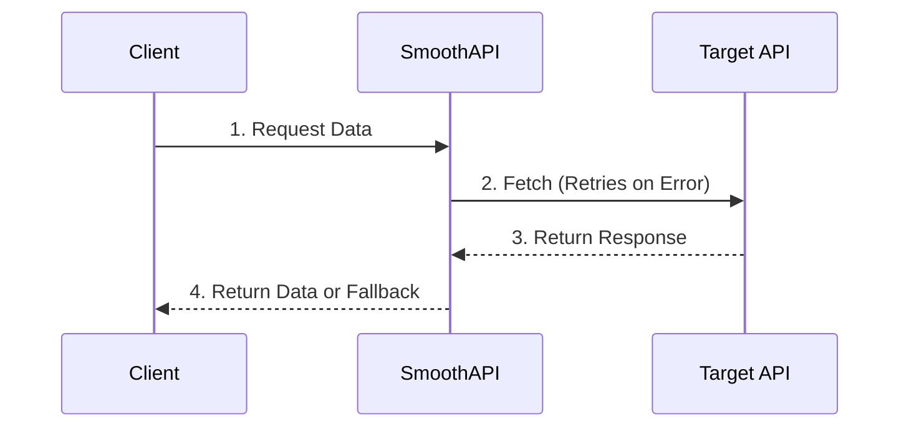

<p align="center">
  <a href="https://smoothapi.org"></a>
</p>

<p align="center">
  A zero-dependency resilience library for TypeScript and Python that makes unreliable APIs safer.
</p>

<p align="center">
  <b>Retries · Backoff · Circuit Breaking · Deduplication · Fallbacks</b>
</p>

<p align="center">
  <a href="https://github.com/AryanSharma48/smoothAPI/actions"></a>
  <a href="https://www.npmjs.com/package/@codingaryan/smoothapi"></a>
  <a href="https://pypi.org/project/smoothapi-py/"></a>
  <a href="https://www.npmjs.com/package/@codingaryan/smoothapi"></a>
  <a href="LICENSE"></a>
</p>

---

## Why SmoothAPI?

Downstream APIs fail unexpectedly, causing cascading breaks and degraded user experiences across your application. **SmoothAPI** gives applications controlled retries, backoff, circuit breaking, request deduplication, and fallbacks—so transient or repeated network failures don't unnecessarily cascade through your app.

---

## Quick Start

### TypeScript / JavaScript

Get started in 3 lines using smart defaults (3 retries, exponential backoff with equal jitter, status code retries):

```ts
import { createSmoothFetch } from '@codingaryan/smoothapi';

const fetch = createSmoothFetch({});
const response = await fetch('https://api.example.com/data');
```

**Need custom retries, timeouts, or circuit breaking?**

```ts
import { createSmoothFetch } from '@codingaryan/smoothapi';

const fetch = createSmoothFetch({
  backoff: { baseDelay: 100, maxDelay: 5000, maxRetries: 3 },
  circuitBreaker: { failureThreshold: 3, cooldownMs: 10000 },
  fallback: { data: 'cached fallback' },
  retryOn: [429, 500, 502, 503, 504],
});

const response = await fetch('https://api.example.com/data');
```

> **Using Python?** → See the [Python Package Documentation](./packages/smooth-api-py/README.md) or jump to [Installation](#python).

---

## What SmoothAPI Gives You

- **Automatic retries** with exponential backoff & equal jitter to avoid hammering recovering servers
- **Circuit breaking** to block requests to repeatedly failing downstream services
- **Request deduplication** to merge identical concurrent HTTP requests and save compute resources
- **Graceful fallbacks** to return safe data when services fail completely
- **Zero runtime dependencies** to keep your bundle footprint light and environment secure

---

## Installation

### TypeScript / Node.js
```bash
npm install @codingaryan/smoothapi
```

### Python
```bash
pip install smoothapi-py
```

---

## Documentation

Not sure if SmoothAPI is right for your project? → [When should I use SmoothAPI?](./docs/when-to-use.md)

- **[TypeScript Documentation](./packages/smooth-api-ts/README.md):** Full API reference, TypeScript types, and configuration options.
- **[Python Documentation](./packages/smooth-api-py/README.md):** Python-specific API reference, decorator usage (`@smooth_api`), and async support.
- **[SmoothAPI Website](https://smoothapi.org):** Interactive documentation, guides, and architectural concepts.

---

## Examples

Explore production-grade examples in the [`/examples`](./examples) directory:

- **Basic Retries & Backoff:** Standard HTTP wrapper setup.
- **Circuit Breakers & Fallbacks:** Gracefully handling downstream outages.
- **Request Deduplication:** Merging concurrent API calls.
- **Chaos Testing:** Testing fault tolerance against the built-in [Express Chaos Server](./sandbox).

---

## Design Philosophy

- **Zero-Dependency Footprint:** No sub-dependencies added to your project.
- **Dual-Language Parity:** Identical resilience behavior in TypeScript and Python.
- **Drop-in HTTP Layer:** Wraps existing request flows without forcing architectural rewrites.
- **Type Safety First:** First-class TypeScript types and Python type hints out of the box.

---

## How It Works

SmoothAPI sits cleanly between your client code and downstream APIs, handling failure modes transparently:



---

## Contributing

Contributions are welcome! Whether it's fixing bugs, improving documentation, adding examples, or implementing new features, every contribution helps improve SmoothAPI.

### Want to Use SmoothAPI?
- **[Quick Start](#quick-start):** Get running in 3 lines.
- **[Documentation](#documentation):** Full TypeScript & Python API references.
- **[Examples](#examples):** Explore browser demos & chaos testing server.

### Want to Contribute?
- **[Contribution Guidelines](./CONTRIBUTING.md):** Review guidelines before opening a pull request.
- **[Good First Issues](https://github.com/AryanSharma48/smoothAPI/issues?q=is%3Aissue+is%3Aopen+label%3A%22good+first+issue%22):** Open issues labeled `good first issue` or `help wanted`.
- **[Discord Community](https://discord.gg/2NabXnQzmv):** Connect directly with maintainers and other contributors.

---

## Development

Instructions for contributors working directly on the SmoothAPI codebase.

### Workspace Layout

```
smooth-api/
├── examples/                   # Browser examples showing usage of SmoothAPI
├── packages/
│   ├── smooth-api-ts/          # TypeScript NPM package (@codingaryan/smoothapi)
│   └── smooth-api-py/          # Python PyPI package (smoothapi-py)
├── sandbox/                    # Shared chaos test server (Express, port 3001)
└── website/                    # Documentation website for SmoothAPI
```

### Run the Chaos Sandbox

```bash
cd sandbox
npm install
node server.js
# Listening on http://localhost:3001
```

### Run Tests

> **Note:** Ensure the Chaos Sandbox server is running in the background (`node server.js` in `/sandbox`) before running tests.

**TypeScript:**
```bash
cd packages/smooth-api-ts
npm install
npm test
```

**Python:**
```bash
cd packages/smooth-api-py
pip install -e ".[dev]"
pytest tests/ -v
```

---

## Roadmap

### Core Reliability
- [x] Exponential backoff with equal jitter
- [x] Finite state machine circuit breaker
- [x] Retry-After header support
- [ ] Request timeout & AbortController support
- [ ] Custom retry strategies

### Observability
- [ ] Event & metric hooks
- [ ] OpenTelemetry integration
- [ ] Structured logging support

### Ecosystem
- [x] Dual language support (TypeScript + Python)
- [x] Next.js example project
- [x] Express integration examples
- [x] Browser examples
- [ ] Benchmark suite

### Advanced Security & Performance
- [x] Request deduplication
- [ ] Redis-backed circuit breaker state
- [ ] Bulkhead pattern support
- [ ] Service health scoring
- [ ] Go engine for high concurrency and bare metal execution

---

## Security

If you discover a potential security vulnerability within SmoothAPI, please do not open a public issue. Review our [Security Policy](./SECURITY.md) or report it confidentially per the policy instructions.

---

## License

[MIT](./LICENSE)
